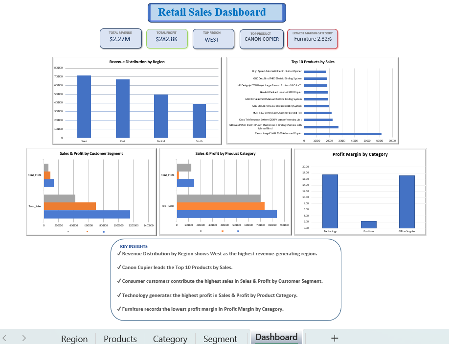

# Retail Sales Performance Analysis

##  Project Overview
Analysed 9,994 rows of retail transaction data using SQL and Excel 
to uncover revenue trends, top products, and profitability insights 
across regions, categories, and customer segments.

## Dataset
- Sample Superstore Dataset
- 9,994 rows
- 21 columns

##  Tools Used
- SQL Concepts:
  - SELECT
  - WHERE
  - GROUP BY
  - ORDER BY
  - Aggregate Functions
  - CASE WHEN
- Microsoft Excel (Dashboard & Visualization)

##  Key Findings
-  West region generates highest revenue at $713K
-  Canon Copier is #1 product at $61.6K in sales
-  Furniture has critically low profit margin of only 2.32%
-  Consumer segment drives 50% of total revenue

## Business Recommendations

- Improve Furniture pricing strategy due to low profit margin.

- Increase marketing efforts in South and Central regions where revenue is comparatively lower.

- Continue investing in Technology products because they generate the highest profits.

- Focus promotions on Consumer customers, as they contribute nearly half of total revenue.

## Skills Demonstrated

- SQL
- Excel
- Data Cleaning
- Data Visualization
- Dashboard Design
- Business Analysis

## Files

```text
Retail-Sales-Analysis
│
├── queries.sql
├── Sample-Superstore.csv
├── Retail_Sales_Dashboard.xlsx
├── dashboard.png
└── README.md
```
## Dashboard Preview

